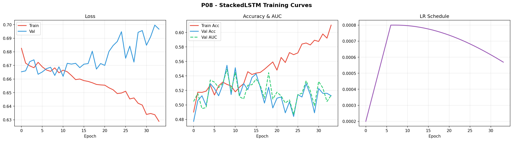
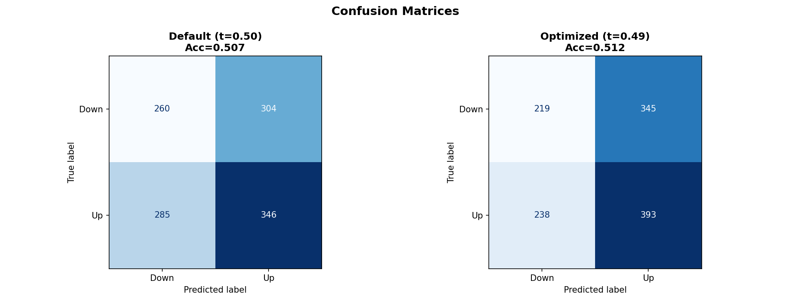
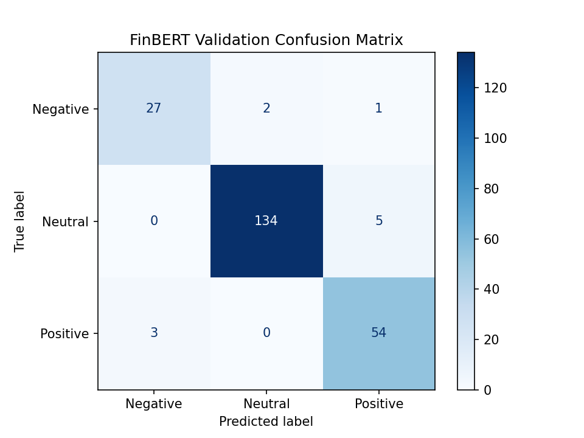
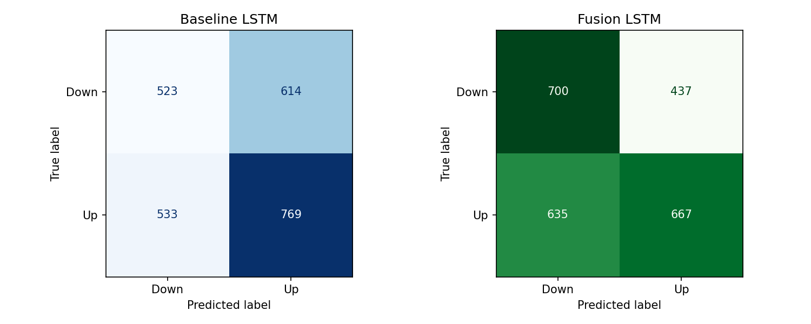
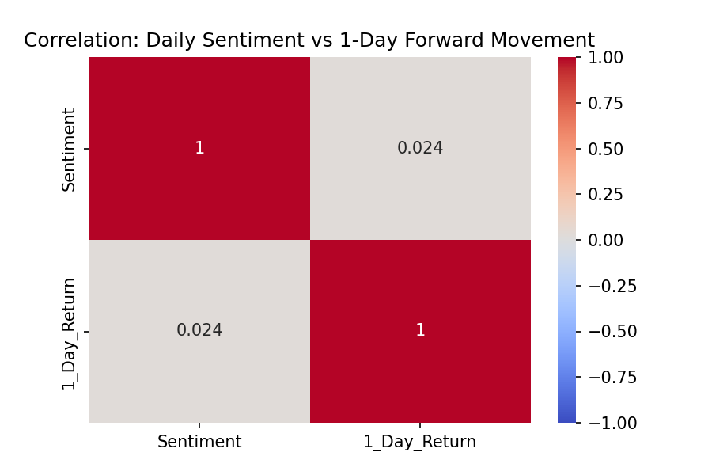
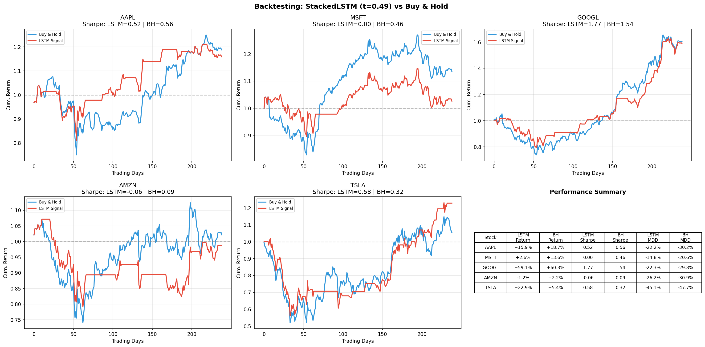

<div align="center">

# 📈 Stock Market Direction Prediction with LSTM & FinBERT Sentiment Fusion

[](https://python.org)
[](https://pytorch.org)
[](https://huggingface.co/ProsusAI/finbert)
[](LICENSE)

**A multimodal deep learning system that fuses LSTM-based technical analysis with FinBERT financial sentiment to predict next-day stock price direction.**

[Technical Report](#-detailed-technical-report) · [Results](#-results-at-a-glance) · [Architecture](#-system-architecture) · [Getting Started](#-getting-started)

</div>

---

## 🎯 Project Overview

This project tackles one of the hardest problems in quantitative finance: **predicting next-day stock price direction**. Instead of relying on a single data source, we build a **multimodal fusion pipeline** that combines:

| Component | Method | Purpose |
|-----------|--------|---------|
| **Technical Branch** | Stacked LSTM (2-layer, 128 hidden) | Learn temporal patterns from 30-day sequences of 18 engineered technical indicators |
| **Sentiment Branch** | Fine-tuned FinBERT | Classify financial news sentiment and convert headlines into daily sentiment scores |
| **Fusion Branch** | Transfer-learning head | Combine LSTM's learned market representation with sentiment signal |

### Stocks Analyzed
```
AAPL  •  MSFT  •  GOOGL  •  AMZN  •  TSLA
```
**Period:** 2021–2026 (1,255 trading days per ticker) &nbsp;|&nbsp; **Sequences:** 5,960 total (train/val/test)

---

## 📊 Results at a Glance

<table>
<tr>
<th>Component</th>
<th>Dataset</th>
<th>Key Metrics</th>
</tr>
<tr>
<td><strong>FinBERT Sentiment Classifier</strong></td>
<td>Financial PhraseBank (226 val samples)</td>
<td>

✅ **Accuracy: 95.13%** &nbsp;|&nbsp; Weighted F1: 95.17% &nbsp;|&nbsp; Macro F1: 93%

</td>
</tr>
<tr>
<td><strong>Standalone LSTM</strong></td>
<td>Chronological test set (1,195 sequences)</td>
<td>

📉 AUC: 0.5069 &nbsp;|&nbsp; Accuracy: 51.21% @ threshold 0.49

</td>
</tr>
<tr>
<td><strong>Baseline on Overlap</strong></td>
<td>2,439 news-price overlap samples</td>
<td>

📊 Accuracy: 52.97% &nbsp;|&nbsp; Macro F1: 0.52

</td>
</tr>
<tr>
<td><strong>🔥 Fusion LSTM</strong></td>
<td>2,439 news-price overlap samples</td>
<td>

🚀 **Accuracy: 56.05%** (+3.08pp) &nbsp;|&nbsp; Macro F1: 0.56

</td>
</tr>
</table>

> **Key Finding:** Sentiment fusion improved `Down` class recall from **0.46 → 0.62** (+35%), suggesting financial news helps identify bearish days that technical indicators alone miss.

---

## 🏗️ System Architecture

```
                    ┌─────────────────────────────────────────────────────────────┐
                    │                   FUSION PIPELINE                           │
                    │                                                             │
  ┌──────────────┐  │  ┌──────────────┐    ┌────────────┐    ┌────────────────┐   │
  │  OHLCV Data  │──┼─▶│ 18 Technical │───▶│  2-Layer   │───▶│ 128-dim Hidden │   │
  │  (yfinance)  │  │  │  Features    │    │   LSTM     │    │    Vector      │─┐ │
  └──────────────┘  │  └──────────────┘    └────────────┘    └────────────────┘ │ │
                    │                                                           │ │
                    │  ┌──────────────┐    ┌────────────┐    ┌────────────────┐ │ │
  ┌──────────────┐  │  │   FNSPID     │───▶│  Fine-tuned│───▶│  1-dim Daily   │ │ │
  │ Financial    │──┼─▶│   Headlines  │    │  FinBERT   │    │  Sentiment     │─┤ │
  │ News         │  │  └──────────────┘    └────────────┘    └────────────────┘ │ │
  └──────────────┘  │                                                           │ │
                    │                      ┌──────────────────┐                 │ │
                    │                      │  CONCAT (129-dim) │◀────────────────┘ │
                    │                      │  FC(129→32)→ReLU  │                   │
                    │                      │  FC(32→1)→Sigmoid │                   │
                    │                      └────────┬─────────┘                   │
                    │                               │                             │
                    │                         ┌─────▼─────┐                       │
                    │                         │  UP / DOWN │                       │
                    │                         └───────────┘                       │
                    └─────────────────────────────────────────────────────────────┘
```

---

## 🔬 Technical Deep Dive

### Feature Engineering (18 Features)

| Category | Features | Purpose |
|----------|----------|---------|
| **Momentum** | `returns`, `ret_5d`, `ret_10d`, `rsi` | Short & medium-term price momentum |
| **Trend** | `macd`, `macd_signal`, `macd_diff`, `price_to_ma20` | Trend direction and strength |
| **Volatility** | `rolling_std_20`, `std_5`, `std_10`, `atr_14`, `bb_pct` | Multi-scale risk measurement |
| **Volume** | `volume_change`, `volume_ratio` | Trading activity confirmation |
| **Intraday** | `high_low_range`, `open_close_diff`, `rolling_mean_20` | Intraday dynamics and drift |

### LSTM Configuration

| Parameter | Value | Rationale |
|-----------|-------|-----------|
| Hidden Size | 128 | Balanced capacity for 5,960 sequences |
| Layers | 2 | Captures hierarchical temporal patterns |
| Dropout | 0.35 | Guards against overfitting on noisy financial data |
| Lookback | 30 days | ~6 trading weeks of context |
| Optimizer | AdamW (lr=8e-4, wd=1e-3) | Decoupled weight decay for better regularization |
| Scheduler | Warmup (8 epochs) + Cosine Decay | Stable start, gradual refinement |
| Early Stopping | Patience 25 on val AUC | Best model at epoch 9 (val AUC = 0.5490) |
| **Total Parameters** | **216,449** | |

### FinBERT Sentiment Pipeline

| Stage | Details |
|-------|---------|
| Base Model | `ProsusAI/finbert` (financial-domain BERT) |
| Fine-tuning Data | Financial PhraseBank `sentences_allagree` (1,129 samples) |
| Classes | Negative (152) · Neutral (692) · Positive (285) |
| Training | 3 epochs, batch 16, weight decay + warmup |
| Scoring | `SentimentScore = P(positive) − P(negative)` → continuous [-1, +1] |
| News Source | FNSPID dataset — 2,954 ticker-matched headlines |

---

## 📈 Visualizations

### LSTM Training Curves
<div align="center">

<br><em>Training loss convergence and validation AUC tracking with early stopping at epoch 34 (best at epoch 9)</em>
</div>

---

### Confusion Matrices

<div align="center">
<table>
<tr>
<td align="center">

<br><strong>Standalone LSTM</strong>
<br><sub>Biased toward Up class (62% recall)</sub>
</td>
<td align="center">

<br><strong>FinBERT Sentiment</strong>
<br><sub>95.13% accuracy on Financial PhraseBank</sub>
</td>
</tr>
<tr>
<td colspan="2" align="center">

<br><strong>Fusion Model</strong>
<br><sub>Down recall improved from 0.46 → 0.62</sub>
</td>
</tr>
</table>
</div>

---

### Sentiment–Price Correlation
<div align="center">

<br><em>Correlation between FinBERT sentiment scores and technical features across tickers</em>
</div>

---

### Backtest Performance
<div align="center">

<br><em>Per-stock cumulative returns: LSTM strategy vs. passive Buy-and-Hold benchmark</em>
</div>

| Stock | LSTM Return | Buy & Hold | LSTM Sharpe | B&H Sharpe |
|-------|:----------:|:----------:|:-----------:|:----------:|
| AAPL  | 15.87% | 18.74% | 0.523 | 0.563 |
| MSFT  | 2.61% | 13.56% | 0.001 | 0.465 |
| GOOGL | 59.07% | 60.32% | **1.766** | 1.536 |
| AMZN  | -1.18% | 2.16% | -0.062 | 0.093 |
| TSLA  | **22.87%** | 5.44% | **0.579** | 0.323 |

> LSTM outperforms Buy-and-Hold on **TSLA** (return & Sharpe) and **GOOGL** (Sharpe), showing selective predictive value.

---

## ⚠️ Honest Limitations

| Limitation | Impact |
|------------|--------|
| **Near-random AUC (0.5069)** | Daily direction prediction from technicals alone is extremely difficult |
| **Fusion not strictly out-of-sample** | Trained & evaluated on same overlap set — improvement is promising, not conclusive |
| **No transaction costs** | Small edges may vanish after spreads, slippage, and commissions |
| **News timing not verified** | Headlines may post after market close — potential look-ahead bias |
| **5 tech stocks only** | Results may not generalize to other sectors/cap sizes |
| **Small dataset** | 5,960 sequences is modest for deep learning |

---

## 🚀 Getting Started

### Prerequisites
```bash
pip install -r requirements.txt
```

### Repository Structure
```
📦 Stock-Sentiment-Fusion/
├── 📄 README.md                              ← You are here
├── 📄 requirements.txt                       ← Python dependencies
├── 📄 technical_report_stock_sentiment_fusion.md  ← Full technical report
├── 📂 Final_Project/
│   ├── 📓 dl_v3.ipynb                        ← Deep Learning notebook
│   ├── 📓 nlp.ipynb                          ← NLP + Fusion notebook
│   ├── 🤖 lstm_p08_v3.pt                     ← Trained LSTM weights
│   ├── 📊 lstm_training_curves.png           ← Training visualization
│   ├── 📊 lstm_confusion_matrix.png          ← LSTM test confusion matrix
│   ├── 📊 finbert_confusion_matrix.png       ← FinBERT confusion matrix
│   ├── 📊 fusion_confusion_matrix.png        ← Fusion model confusion matrix
│   ├── 📊 sentiment_correlation.png          ← Sentiment–price correlation
│   └── 📊 backtest_results.png               ← Strategy backtest results
└── 📄 .gitignore
```

### Running the Notebooks
1. **Deep Learning Pipeline** → Open `Final_Project/dl_v3.ipynb`
   - Downloads OHLCV data via yfinance
   - Engineers 18 technical features
   - Trains stacked LSTM with early stopping
   - Runs threshold tuning and backtesting

2. **NLP + Fusion Pipeline** → Open `Final_Project/nlp.ipynb`
   - Fine-tunes FinBERT on Financial PhraseBank
   - Scores FNSPID news headlines
   - Builds and evaluates sentiment-technical fusion model

---

## 🔮 Future Directions

- **Transformer time-series models** (Temporal Fusion Transformer, PatchTST)
- **Attention-based headline fusion** instead of scalar averaging
- **Macro features** (VIX, treasury yields, sector ETFs)
- **Walk-forward validation** for robust out-of-sample evaluation
- **Event-aware modeling** (earnings calendars, analyst ratings)
- **Real-time streaming pipeline** with timestamp-safe news alignment
- **Reinforcement learning** for position sizing and risk management


<div align="center">

**Built with** ❤️ **using PyTorch, HuggingFace Transformers, and yfinance**

*Deep Learning × Natural Language Processing — Integrated Project*

</div>
